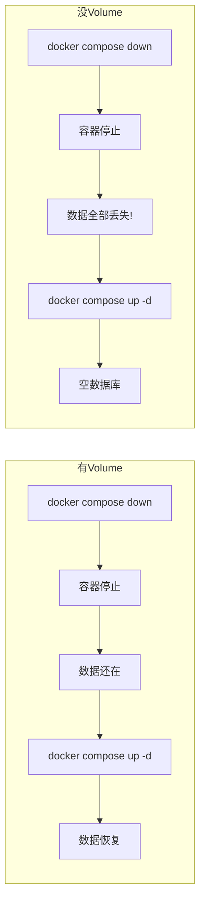

# 🐳 论文生成系统 — Docker 从零部署指南

> 写给完全没接触过 Docker 的同学。跟着步骤走，把项目跑起来。

---

## 📥 第一步：下载安装 Docker

### Windows 用户

1. **检查系统要求**
   - Windows 10 64位：专业版/企业版/教育版（20H1 或更高）
   - Windows 11：任何版本
   - 必须开启 CPU 虚拟化（BIOS 里开启 VT-x/AMD-V）
   - 必须开启 WSL 2

2. **安装 WSL 2**（如果没装过）

   打开 **PowerShell（管理员）**，粘贴运行：
   ```powershell
   wsl --install
   ```
   重启电脑。

3. **下载 Docker Desktop**

   👉 https://www.docker.com/products/docker-desktop/

   点击 **Download for Windows**（按钮可能是蓝色的），下载约 500MB 的安装包。

4. **安装 Docker Desktop**

   - 双击安装包
   - 一路点 Next
   - 安装完成后 **重启电脑**
   - 启动 Docker Desktop（开始菜单搜 Docker）
   - 等待右下角鲸鱼图标稳定不动（首次启动约 1-2 分钟）

5. **验证安装**

   打开 **CMD 或 PowerShell**，输入：
   ```powershell
   docker --version
   ```
   看到类似 `Docker version 29.x.x` 就成功了。

### Mac 用户

1. 访问 https://www.docker.com/products/docker-desktop/
2. 点击 **Download for Mac**（选择 Apple Silicon 或 Intel 对应版本）
3. 安装后打开 Docker Desktop
4. 等待顶部菜单栏鲸鱼图标稳定

### Linux 用户

```bash
# Ubuntu/Debian
sudo apt update
sudo apt install docker.io docker-compose-v2
sudo systemctl start docker
sudo usermod -aG docker $USER  # 避免每次 sudo
# 退出重新登录生效
```

---

## 🧠 第二步：Docker 是什么？（3 分钟极简概念）

先理解三个词就够了：

| 概念 | 想象成 | 解释 |
|------|--------|------|
| **Image（镜像）** | 📀 安装光盘 | 包含了运行项目所需要的一切（Java、Node、代码编译产物） |
| **Container（容器）** | 🖥️ 一台迷你电脑 | 镜像运行起来就是一个容器，里面跑着你的项目 |
| **Volume（数据卷）** | 💾 U 盘 | 容器删除后数据会丢失，Volume 可以把数据持久化存下来 |

**一句话理解：**
> 你不需要在自己电脑上装 Java、Node、PostgreSQL —— Docker 把这些东西都封装在镜像里，拿到镜像就能跑，不用配环境。

**在我们项目里：**
- `thesis-generator-backend` 镜像 → 容器 = 后端（Java 21 + Spring Boot）
- `thesis-generator-frontend` 镜像 → 容器 = 前端（Node 构建产物 + Nginx）
- `postgres:16-alpine` 镜像 → 容器 = 数据库（PostgreSQL）

三个容器通过 `docker-compose.yml` 一键启动，它们之间通过网络互相通信。

---

## 🚀 第三步：下载并运行项目

### 3.1 获取项目代码

**方法一：下载 ZIP（最简单）**

1. 打开项目 GitHub 页面
2. 点绿色的 **Code** 按钮 → **Download ZIP**
3. 解压到某个文件夹，比如 `D:\thesis-generator`

**方法二：Git 克隆（如果你装了 Git）**

```bash
git clone https://github.com/zzy154204-gif/thesis-generator.git
cd thesis-generator
```

### 3.2 确认项目结构

在项目文件夹里，你应该看到这些文件（最重要的几个）：

```
thesis-generator/
├── docker-compose.yml   ← 🎯 Docker 编排文件（一键启动脚本）
├── Dockerfile            ← 后端构建说明书
├── nginx.conf            ← 前端 Nginx 配置
├── thesis-generator-web/
│   └── Dockerfile        ← 前端构建说明书
└── .env.example          ← 配置模板
```

### 3.3 启动项目

打开 **CMD 或 PowerShell**，**cd 到项目文件夹**（替换成你的实际路径）：

```powershell
cd D:\thesis-generator
```

然后粘贴运行：

```powershell
docker compose up -d --build
```

**这条命令做了什么？**
- `docker compose` — 读取 `docker-compose.yml`
- `up` — 启动所有服务
- `-d` — 后台运行（detach 模式）
- `--build` — 先构建镜像再启动（第一次必须加）

### 3.4 等待构建

第一次运行会下载很多东西，**需要 10~30 分钟**（取决于网速）：

```
1. 下载 PostgreSQL 数据库镜像    (~150MB)
2. 下载 Java JDK 镜像            (~300MB)
3. 下载 Java JRE 镜像            (~200MB)
4. 下载 Node.js 镜像             (~120MB)
5. 下载 Nginx 镜像               (~40MB)
6. 下载 LibreOffice 办公组件      (~300MB) ← 这个最慢
7. 下载 Maven 的 Java 依赖包     (~100MB)
8. 下载 npm 的前端依赖包         (~50MB)
```

**不要着急，等终端出现 `done` 或者回到命令行提示符就行。**

### 3.5 验证是否成功

运行：

```powershell
docker compose ps
```

应该看到类似：

```
NAME          IMAGE                       SERVICE    STATUS         PORTS
tg-backend    thesis-generator-backend    backend    Up             0.0.0.0:8080->8080/tcp
tg-db         postgres:16-alpine          db         Up (healthy)   0.0.0.0:5433->5432/tcp
tg-frontend   thesis-generator-frontend   frontend   Up             0.0.0.0:8081->80/tcp
```

三个都是 `Up` 就成功了！🎉

### 3.6 打开系统

浏览器访问：

- **🖥️ 前端页面** → http://localhost:8081
- **📖 API 文档** → http://localhost:8081/swagger-ui/index.html
- **🔧 后端 API** → http://localhost:8080

---

## 🛠️ 第四步：日常使用命令

| 你想做什么 | 命令 |
|-----------|------|
| 启动所有服务 | `docker compose up -d` |
| 停止所有服务 | `docker compose down` |
| 停止并清空数据（⚠️ 会删数据库和图片） | `docker compose down -v` |
| 查看服务状态 | `docker compose ps` |
| 查看所有日志（实时滚动） | `docker compose logs -f` |
| 只看后端日志 | `docker compose logs -f backend` |
| 重启某个服务 | `docker compose restart backend` |
| 重新构建并启动（改代码后） | `docker compose up -d --build` |
| 查看所有数据卷 | `docker volume ls` |
| 查看卷存在哪里 | `docker volume inspect thesis-generator_pgdata` |

---

## ❓ 常见问题

### Q: 端口被占用，启动失败？

```
Error response from daemon: Port is already allocated
```

说明 8080/8081/5433 里某个端口被其他程序占了。

**解决方法**：改 `docker-compose.yml` 里的端口映射，比如：

```yaml
services:
  frontend:
    ports:
      - "8082:80"       # 把 8081 改成 8082
  backend:
    ports:
      - "8083:8080"     # 把 8080 改成 8083
  db:
    ports:
      - "5434:5432"     # 把 5433 改成 5434
```

### Q: 构建很慢 / 卡住了？

第一次是正常的。如果是中途卡住，可以：

```powershell
# 按 Ctrl+C 取消，然后重试
docker compose up -d --build
```

如果反复失败，检查网络（可能需要开代理）。

### Q: 如何知道服务有没有启动好？

看日志：

```powershell
docker compose logs backend --tail 20
```

最后一行看到 `Started ThesisGeneratorApplication` 就说明后端启动成功了。

### Q: 修改了代码，如何更新？

```powershell
docker compose up -d --build
```

会自动重新构建改动的部分（没改的用缓存），然后重启。

### Q: 我想进容器里面看看？

```powershell
docker exec -it tg-backend sh      # 进后端容器
docker exec -it tg-db sh           # 进数据库容器
docker exec -it tg-frontend sh     # 进前端容器
```

---

## 📦 数据持久化（Volume 详解）

数据卷（Volume）是 Docker 用来持久化数据的机制。

**没有 Volume 会怎样？**



**项目里的两个 Volume：**

```yaml
volumes:
  pgdata:    # → 数据库文件      → 存在 Docker 管理的目录里
  uploads:   # → 用户上传的图片  → 同上
```

**Volume 存在哪里？**
- Windows: `\\wsl$\docker\volumes\thesis-generator_pgdata`
- Mac/Linux: `/var/lib/docker/volumes/thesis-generator_pgdata`

**日常使用记住一条：**
> 停服务用 `docker compose down`（不要加 `-v`），数据就不会丢。

---

## 🤖 第五步：给 AI 助手的部署提示词

如果你想把部署任务交给 AI（如 Claude、ChatGPT 等），可以直接复制下面这段提示词发给它：

---

### 提示词模板（中文版）

> 我需要部署一个项目，这是项目说明：
>
> **项目名称**：论文生成系统
> **项目路径**：[替换成你的实际路径，例如 D:\thesis-generator]
> **项目描述**：Spring Boot 后端 + Vue 3 前端的论文在线编辑系统，使用 Docker 部署。
>
> 项目根目录包含以下关键文件：
> - docker-compose.yml（三服务编排：PostgreSQL + Java后端 + Nginx前端）
> - Dockerfile（后端构建）
> - thesis-generator-web/Dockerfile（前端构建）
> - nginx.conf（Nginx 反向代理配置）
> - .env.example（环境变量模板）
>
> **我的环境**：[Windows 11 / macOS / Linux]
> **我的需求**：帮我把这个项目用 Docker 跑起来，包括：
> 1. 检查我是否安装了 Docker
> 2. 如果没装，指导我安装 Docker Desktop
> 3. 运行 docker compose up -d --build
> 4. 检查服务是否正常启动
> 5. 告诉我如何访问系统

---

### 提示词模板（English version）

> I need to deploy a project using Docker. Here are the details:
>
> **Project**: Thesis Generator - a Spring Boot + Vue 3 web app for online thesis editing
> **Project path**: [your actual path]
>
> The root directory has these files:
> - docker-compose.yml (3 services: PostgreSQL, Java backend, Nginx frontend)
> - Dockerfile (backend build)
> - thesis-generator-web/Dockerfile (frontend build)
> - nginx.conf
> - .env.example
>
> **My OS**: [Windows 11 / macOS / Linux]
>
> Please help me:
> 1. Check if Docker is installed
> 2. Guide me to install Docker Desktop if needed
> 3. Build and start with `docker compose up -d --build`
> 4. Verify all services are running
> 5. Tell me the URLs to access the system

---

### 如果 AI 能读文件（比如 Claude Code），更简单的提示词：

> 我在 `[项目路径]` 下有一个论文生成系统项目，是基于 Spring Boot + Vue 3 的，已经配好了 Docker 相关的文件（Dockerfile、docker-compose.yml、nginx.conf）。
>
> 我的电脑还没装 Docker，帮我：
> 1. 指导我安装 Docker Desktop
> 2. 用 Docker 把项目跑起来
> 3. 验证服务正常运行
>
> 操作系统是 [Windows 11 / macOS / Linux]

---

## 📚 总结 Checklist

- [ ] 下载 Docker Desktop 并安装
- [ ] 重启电脑
- [ ] 打开 Docker Desktop（等待就绪）
- [ ] 打开 CMD/PowerShell，cd 到项目目录
- [ ] 运行 `docker compose up -d --build`
- [ ] 等待构建完成（10~30 分钟）
- [ ] 运行 `docker compose ps` 确认三个服务都是 Up
- [ ] 浏览器打开 http://localhost:8081
- [ ] 打开 http://localhost:8081/swagger-ui/index.html 看 API 文档
- [ ] 如果成功了，记得告诉队友们 🎉
